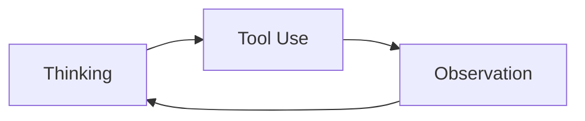

Have you read Karpathy's AI knowledge base but still feel unsure how to actually use it?

My answer is to start with a practical first project: let AI maintain a blog through a knowledge base.

Over the past year, I have been exploring real-world AI engineering. Now I want to organize my practice, research, and writing into a workflow that can keep improving over time: original drafts live in `raw/`, long-term knowledge lives in `wiki/`, and public articles are published to `cblog`. The work in between—structuring, categorizing, formatting, building, and publishing—can increasingly be handled by AI following clear SOPs.

## My AI Research Over the Past Year

I started exploring real-world AI implementation around April last year.

At that time, Dify and n8n were everywhere. The internet was full of tutorials about building n8n workflows, creating AI knowledge bases with Dify, and similar topics. I also began my AI journey with n8n. MCP was one of the hottest topics then, and it felt mysterious enough that I really wanted to understand it.

### First Project: Querying Security Alerts with Natural Language

My first hands-on project was connecting n8n with MCP to query security alert information through natural language.

The rough flow was:

1. Use MCP to connect to the Wazuh indexer;
2. Use Feishu as the natural-language interface;
3. Let users talk to a Feishu bot;
4. Forward messages from the bot to n8n;
5. Let n8n handle the MCP calls;
6. Return the final Wazuh query results through the Feishu bot.

This project gave me my first concrete understanding of how AI could be used and how the overall mechanism worked.

### Second Project: An Enterprise AI Security Testing System

My second project was an enterprise-grade AI security testing system customized for a large financial client.

This project completely exposed the limitations of tools like Dify and n8n. It also helped me understand the constraints of mainstream AI Agent frameworks at the time, such as LangChain, LangGraph, and Eino.

Those frameworks are valuable, but in real projects, layer after layer of abstraction quickly increases the cost of understanding and debugging. From first principles, the simplest AI Agent only needs to repeatedly call tools. At its core, it is a loop of `Thinking -> Tool Use -> Observation`:

Instead of spending too much time understanding every abstraction in those frameworks, it was more practical to build a system that matched the project directly. So I implemented a complete enterprise-grade general AI Agent framework from zero to one and deployed it successfully for the client.

Of course, I took many detours during this process. Back then, AI programming tools were far weaker than they are today. Most backend code had to be written manually, and AI was mostly useful for frontend work. Because my own understanding of AI was still immature, I rewrote the system countless times.

### Third Project: A Multi-Agent Trading Platform

My third project was building a multi-agent trading platform on top of my own AI Agent framework.

That project won the award for best return. For me, it further proved one thing: the hard part of an Agent system is not only whether it can call tools, but how to organize goals, tools, state, feedback, and evaluation into a system that can keep improving.

### Fourth Project: OpAgent

My fourth project came from a very practical frustration: I did not want to keep switching between Claude Code, Codex, and Markdown editors.

I wanted a Cursor-like application, but one focused more on Markdown, multiple workspaces, and knowledge-base collaboration. That became OpAgent, the tool I am using right now.

For me, OpAgent is not just an editor. It is also the workspace where I organize AI engineering experience, research, writing, and publishing.

## What Karpathy's AI Knowledge Base Inspired

The part of Karpathy's AI knowledge base that inspired me the most was the `raw/` directory.

My understanding is this: do not rush to turn everything into polished knowledge-base pages from the beginning. A better approach is to preserve the original input first, then let AI transform it when needed based on context and SOPs.

So my plan is simple:

- Write original articles into the `raw/` directory;
- Distill long-term knowledge into `wiki/`;
- Document publishing workflows as SOPs;
- Let AI read the SOPs and publish articles from `raw/` to the blog system;
- I keep writing, and AI handles the structure, categorization, and publishing.

The key value of this structure is that raw content stays untouched, while publishing workflows do not pollute the context of other tasks.

## Structure Design: AGENTS, index, and wiki

My setup is simple:

- `AGENTS.md` tells AI the overall structure and rules of the workspace;
- `index.md` tells AI where the important entry points are, including where the publishing workflow lives;
- `wiki/` stores detailed SOPs, such as the workflow from `raw` to `cblog`;
- `raw/` only stores original content and should not be directly modified during publishing.

When I ask AI to publish a blog post, it first reads the workspace rules, then follows `index.md` to find the publishing SOP, and finally executes the workflow step by step.

With this setup, publishing a blog post can become a single sentence:

> Publish this article to cblog.

AI can then automatically:

1. Read the original article;
2. Check whether it contains anything unsuitable for public release;
3. Convert it into a blog-friendly structure;
4. Copy the required images;
5. Write the article into the cblog project;
6. Run a build to verify it;
7. Commit and push the result.

Later, this workflow can be extended to platforms such as WeChat Official Accounts, X, Xiaohongshu, and more. Each platform only needs its own SOP.

## Hosting the Blog on Cloudflare

Here is a quick introduction to deploying a blog for free.

### 1. Create a GitHub Repository

If you want to deploy on Cloudflare, the Astro framework is usually a convenient choice because it integrates well with Cloudflare.

The blog project I am currently using is [ColinAgent/cblog](https://github.com/ColinAgent/cblog).

### 2. Prepare a Domain

If you do not already have a domain, you can buy one first. Cloudflare can also be used to purchase and manage domains directly.

### 3. Create a Cloudflare Worker

You can host the blog on Cloudflare Workers without buying a separate server.

Ideally, you can connect the GitHub repository directly inside Cloudflare. After that, every push can automatically trigger a new blog deployment.

## Publishing

From now on, publishing a blog post can be very simple.

Open a conversation, drag the original article into the chat box, and tell AI to publish it to cblog.

This way, I only need to maintain the original content under `raw/`. How the article is categorized, formatted, built, and pushed can gradually become AI's responsibility.

That is also my understanding of AI-native knowledge management: it is not just combining a chat window, Markdown files, and folders. It is about creating a clear structure so AI can act according to rules.