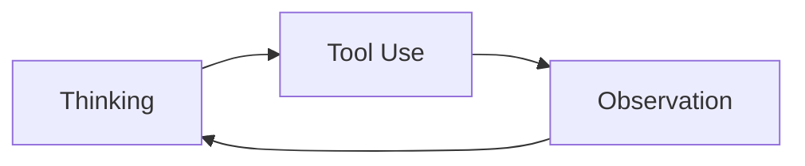

你是不是看了 Karpathy 的 AI 知识库，却不知道它到底该怎么用？

我的答案是：先从一个最小项目开始，让 AI 通过知识库维护博客。

过去一年多，我一直在深入研究 AI 工程落地。现在我准备把这些实践、思考和写作重新组织起来：原始内容放在 `raw/`，长期知识沉淀到 `wiki/`，对外发布交给 `cblog`。中间的整理、归类、排版、构建和发布流程，都尽量交给 AI 按 SOP 自动执行。

## 最近一年的 AI 研究

我大概是从去年 4 月开始接触 AI 落地的。

当时最流行的是 Dify、n8n，网上到处都是搭建 n8n 工作流、Dify AI 知识库之类的内容。我也是从 n8n 开始了解 AI 的。那时 MCP 很火，看起来也很神秘，我很想搞清楚它到底能做什么。

### 第一次实践：用自然语言查询安全告警

我的第一次实践，是用 n8n 接入 MCP，实现自然语言查询安全告警信息。

大致流程是：

1. 用 MCP 接入 Wazuh 的 indexer；
2. 自然语言入口放在飞书机器人里；
3. 用户和飞书机器人对话；
4. 消息转发到 n8n；
5. n8n 调用 MCP 完成查询；
6. 最后把 Wazuh 的查询结果通过飞书机器人返回给用户。

这个项目让我初步了解了 AI 的用法，以及 AI 系统背后大致的工作原理。

### 第二次实践：企业级 AI 安全测试系统

第二次实践，是做一个企业级 AI 安全测试系统。

这个系统让我彻底理解了 Dify、n8n 这类平台在复杂场景下的限制，也让我看清了很多主流 AI Agent 框架的问题，比如 LangChain、LangGraph、Eino 等。

这些框架当然有价值，但在真实项目里，层层封装会带来很高的理解成本和调试成本。

回到第一性原理，一个最简单的 AI Agent，本质上只需要能够循环调用工具。它无非是一个 `Thinking -> Tool Use -> Observation` 的循环：

与其花大量时间去理解复杂框架，不如从头实现一版真正符合项目需要的系统。于是我从 0 到 1 写了一套企业级 AI Agent 通用框架，并在实际客户环境中完成落地。

当然，这个过程也走了很多弯路。那时候 AI 编程还没有现在这么强，后端基本全靠手写，AI 主要只能辅助写一些前端。我对 AI 系统的理解也还不够深入，所以项目中重写了很多遍。

### 第三次实践：多 Agent 交易平台

第三次实践，是基于自己的 AI Agent 框架构建多 Agent 交易平台。

这个项目最终拿到了最佳收益奖。对我来说，它进一步证明了一件事：Agent 系统真正困难的部分，不只是“能不能调用工具”，而是如何把目标、工具、状态、反馈和评估组织成一个可持续迭代的系统。

### 第四次实践：OpAgent

第四次实践，就是我现在正在使用的 OpAgent。

我不想在 Claude Code、Codex 和 Markdown 软件之间不断切换，所以想做一款类似 Cursor，但更侧重 Markdown、多工作空间和知识库协作的一体化软件。

对我来说，OpAgent 不只是一个编辑器，它也是我整理 AI 工程经验、写作、研究和发布内容的工作台。

## Karpathy 的 AI 知识库给我的启发

Karpathy 的 AI 知识库里，对我启发最大的是 `raw/` 目录。

我的理解是：不要一开始就急着把所有内容整理成精致的知识库页面。更好的方式是先保留原始输入，让 AI 在需要的时候根据上下文和 SOP 做转换。

所以我准备这样做：

- 原始文章写到 `raw/` 目录；
- 长期知识沉淀到 `wiki/`；
- 发布流程写成 SOP；
- AI 读取 SOP 后，把 `raw/` 里的文章发布到博客系统；
- 我只负责持续输入文章，剩下的整理、归类、发布都交给 AI。

这套结构的关键价值是：原始内容不会被破坏，发布流程也不会污染其他工作流的上下文。

## 结构设计：AGENTS、index 和 wiki

我的设计很简单：

- `AGENTS.md` 负责告诉 AI 整个工作区的基本结构和规则；
- `index.md` 负责告诉 AI 当前有哪些重要入口，包括发布流程在哪里；
- `wiki/` 负责存放具体 SOP，例如 raw 到 cblog 的发布流程；
- `raw/` 只保存原始内容，发布时不直接修改它。

当我让 AI 发布博客时，它会先读取工作区规则，再通过 `index.md` 找到发布 SOP，然后按 SOP 执行。

这样一来，每次发布博客只需要说一句：

> 发布这篇文章到 cblog。

AI 就会自动完成：

1. 读取原始文章；
2. 检查是否包含不适合公开的信息；
3. 转换成适合博客阅读的结构；
4. 复制必要图片；
5. 写入 cblog 项目；
6. 构建验证；
7. 提交并推送。

后续如果要扩展到微信公众号、X、小红书，也只需要继续补充对应平台的 SOP。

## 用 Cloudflare 免费托管博客

这里也简单介绍一下，怎么免费部署博客。

### 1. 创建 GitHub 仓库

如果要部署到 Cloudflare 上，Astro 框架会比较方便，因为它和 Cloudflare 的集成很好。

我当前使用的博客项目是：[ColinAgent/cblog](https://github.com/ColinAgent/cblog)。

### 2. 准备域名

如果还没有域名，可以先购买一个域名。Cloudflare 本身也可以直接购买和管理域名。

### 3. 创建 Cloudflare Worker

然后创建 Cloudflare Worker，把项目托管到 Cloudflare 上。这样就不需要单独购买服务器。

理想情况下，可以在 Cloudflare 里连接 GitHub 仓库。之后每次推送代码，Cloudflare 都会自动部署博客。

## 发布方式

以后发布博客就很简单了。

直接打开对话，把原始文章拖进对话框，然后告诉 AI：发布到 cblog。

这样我只需要维护 `raw/` 目录下的原始内容。后续怎么整理、怎么归类、怎么生成博客文章、怎么构建和推送，都可以逐渐交给 AI。

这也是我理解的 AI 原生知识管理：不是简单把聊天窗口、Markdown 和文件夹拼在一起，而是有一套清晰结构，让 AI 能够按规则行动。